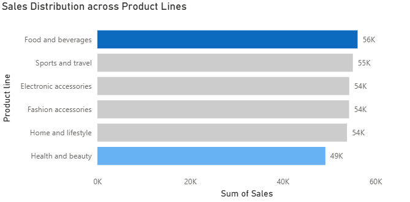
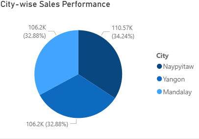
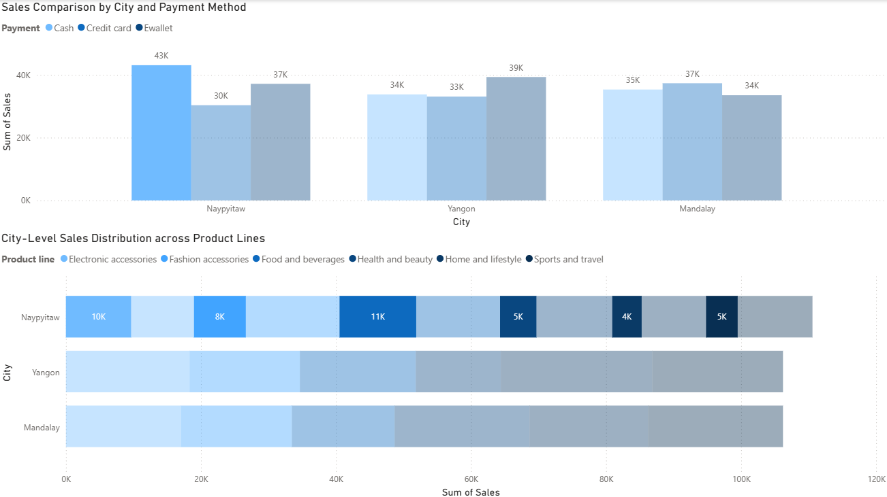
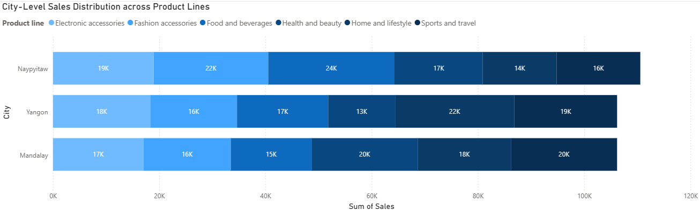
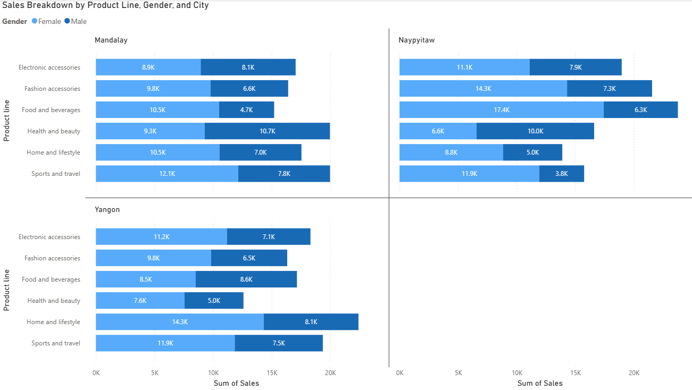

# **🛒 Supermarket Sales Dataset Analysis**
## **📌 Project Overview**

This project analyzes the Supermarket Sales Dataset (Kaggle) to explore customer purchasing behaviors, sales trends, and payment preferences. The main objective is to uncover insights through exploratory data analysis (EDA) and interactive dashboards in Power BI.

The workflow combines Python (Jupyter Notebook) for preprocessing and cleaning the dataset, followed by Power BI for visualization and storytelling. No predictive modeling is included; instead, the focus is on discovering key business insights.

## **📂 Dataset Description**

Source: Kaggle – Supermarket Sales Dataset

Records: ~1,000 transactions across three supermarket branches

Features (17 total):

Branch/Location: Branch, City

Customer Demographics: Gender, Customer Type

Transaction Details: Invoice ID, Date, Time, Product Line, Quantity, Unit Price, Total, Tax, COGS

Payment: Payment Method

Other Attributes: Rating, Gross Margin %, Gross Income

## **📊 Key Findings (EDA & Visualization)**

The analysis revealed several important insights into supermarket sales performance. Sales across product lines were relatively balanced, though **Food and Beverages** stood out as the top performer with over **56K in sales**, while **Health and Beauty** recorded the lowest at **49K**.

When comparing sales across cities, the contribution was fairly even, with each city accounting for around **30% of total sales**. However, **Naypyitaw led with the highest share (34.24%)**, followed by Mandalay and Yangon with slightly lower contributions.

Looking deeper into consumer behavior in **Naypyitaw, cash emerged as the most widely used payment method**. Customers there primarily used cash to purchase **Food and Beverages (11K)**, followed closely by **Electronic Accessories (10K)**.

Product line performance also varied by city. **Naypyitaw recorded the strongest sales in Health and Beauty (24K) and Fashion Accessories (22K)**, while **Yangon excelled in Sports and Travel (22K) and Home and Lifestyle (19K)**. In contrast, **Mandalay showed more balanced performance, with Home and Lifestyle (20K) and Sports and Travel (20K) leading the way**. These differences highlight distinct consumer preferences across regions.

Gender-based analysis revealed further insights. Across most product lines and cities, **female customers tended to spend more**, particularly in lifestyle and travel-related categories. For example, females dominated **Sports and Travel (12.1K) and Food and Beverages (10.5K)** in Mandalay, as well as **Home and Lifestyle (14.3K) and Sports and Travel (11.9K)** in Yangon. Meanwhile, males showed stronger preferences in **Health and Beauty** and certain food categories, such as **10K in Health and Beauty in Naypyitaw**. Overall, while both genders contributed meaningfully, spending habits reflected notable differences by city and category.

## **💡 Business Recommendations**
- **Focus on Health and Beauty Products**: This product line has the highest sales across all cities, particularly in Yangon and Naypyitaw. It’s advisable to allocate more marketing and inventory resources to this category to capitalize on its demand.

- **Segment Marketing by Payment Method**: The sales pattern by payment method shows that cash payments dominate across all ci_ties, especially in Naypyitaw. Providing additional promotions or benefits for cash transactions could further increase sales. For cities like Yangon, where e-wallets are more popular, emphasizing e-wallet payment options could boost sales there.

- **Target Women Consumers**: Female customers are contributing significantly to the sales, particularly in the Food and Beverages, Health and Beauty, and Home and Lifestyle product categories. Tailoring campaigns specifically for female consumers could be more effective, especially in cities like Mandalay and Naypyitaw.

- **City-Specific Strategies**:

    - For **Naypyitaw**, the focus should be on increasing the variety and availability of Food and Beverages as it is the top-selling product category there.
    
    - In **Yangon**, Health and Beauty products show strong sales, and focusing on expanding this category along with more e-wallet promotions could further drive growth.
    
    - For **Mandalay**, a good strategy would be to increase the focus on Sports and Travel, which performs relatively well there.

- **Explore Gender Differences in Product Line Sales**: Men and women tend to purchase different product lines, so businesses should consider customizing product offerings and marketing for specific gender groups to optimize sales.

- **Diversify Product Lines in Mandalay**: While most cities show more balanced sales across categories, Mandalay has notable variation. For example, the high demand for Sports and Travel products should be leveraged by offering promotions or launching targeted campaigns in this segment.

- **Optimize Inventory Across Cities**: Based on city-level sales breakdowns, ensure that the inventory is aligned with the sales patterns. For example, increase stock for Health and Beauty products in Yangon and Food and Beverages in Naypyitaw.

## **🛠️ Tech Stack**

Python (Jupyter Notebook): pandas, numpy → preprocessing & cleaning

Power BI: interactive dashboards & visual storytelling